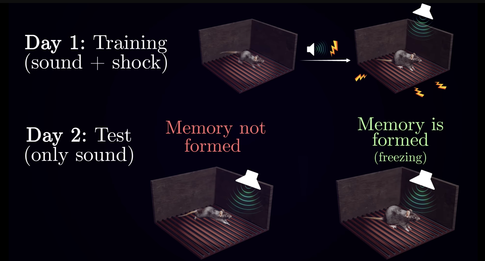
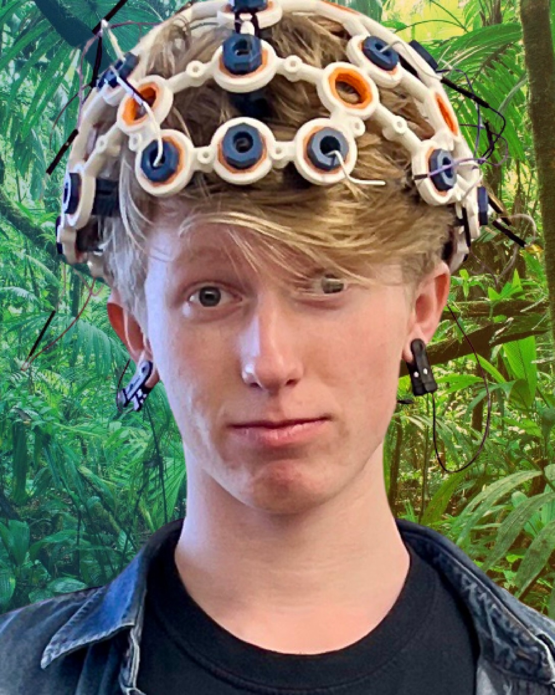

# Welcome to the Repo for Julian's CompNeuro DiRP Group! 🧠

> Curious about the computational foundations of human experience and how neuroscience and AI drive each other’s advancements? In the Computational Neuroscience mentorship group, we’ll explore recent research on the development and function of intelligent biological systems, discuss what the results can teach us about enhancing AI, and examine how AI, in turn, can deepen our understanding of the brain.

That includes topics like engrammatic representations of memory, the workings of the hippocampus, infant learning through synaptic pruning, and much more!

***NO background in biology required!***

This journal club will run in tandem with *Longhorn Neurotech's Journal Club*, which I am also leading.

---

### **STRUCTURE SUBJECT TO CHANGE**

This DiRP group will be structured as a journal club. Once a week, we will meet to discuss papers/videos about a specified topic in computational neuroscience. These topics will be influenced by the interests of group members. I'm always open to exploring new areas, so suggestions for topics are highly encouraged!

For now, feel free to check out the [Resources](./Resources) folder for some papers we may be going over! Some of these topics are highly complimented by [Artem Kirsanov's YouTube channel](https://www.youtube.com/@ArtemKirsanov/featured), so I recommend watching some of these as well (they have very nice animations too).

  

---

### A Little About Me:

I’m a fourth-year student double majoring in Computer Science and the Neuroscience Scholars Program with a minor in Business. I’m a founding member of the DMIC lab’s AI and neuroimaging team and currently serve as the Research and Development Lead at Longhorn Neurotech. I plan to pursue a PhD focused on using brain organoids as models for brain-computer interfaces (BCI). In my free time, I produce music and rock climb!

  

---

### Calendar 📅:

- **[DATE TBD]**: The first day of the group will be a basic introduction to neuroscience (behavior of individual neurons and neurons in groups). We will also pick the topic for the next meeting.

---

Happy to have you here!
